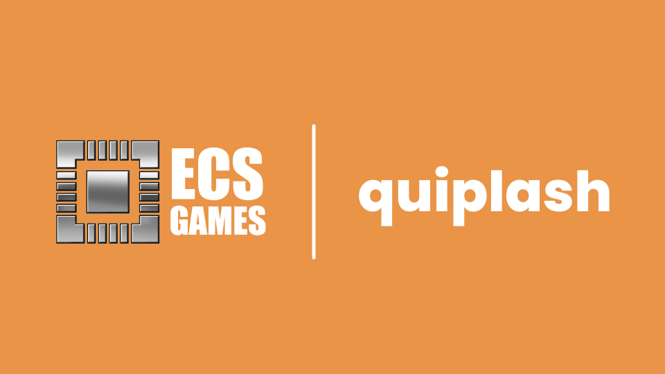

<p align="center">
  <a href="" rel="noopener">
    </a>
</p>
<h3 align="center">Quiplash Game</h3>

---

<p align="center">A full stack multiplayer game built with Node.js and Express for the frontend and python Azure Functions for the backend.
</p>

## 📝 Table of Contents

- [📝 Table of Contents](#-table-of-contents)
- [🏁 Getting Started](#-getting-started)
  - [Prerequisites](#prerequisites)
  - [Installation](#installation)
- [🎈 Usage](#-usage)
- [🔧 Configuration](#-configuration)
- [⛏️ Built With](#️-built-with)

## 🏁 Getting Started <a name="getting_started"></a>

These instructions will get you a copy of the game running on your local machine.

### Prerequisites

You will need to have the following software installed on your machine:
- [Node.js](https://nodejs.org/)
- [npm](https://www.npmjs.com/)
- [Python](https://www.python.org/downloads/) (version 3.6 or later)
- [Azure Functions Core Tools](https://docs.microsoft.com/en-us/azure/azure-functions/functions-run-local)

### Installation

Clone the repository to your local machine:

```bash
git clone https://github.com/ayazb7/quiplash-game
cd quiplash-game
```

## 🎈 Usage <a name="usage"></a>

### Running the Frontend

Navigate to the frontend directory:

```bash
cd frontend
```

Install the dependencies:

```bash
npm install
```

Start the frontend server:

```bash
npm start
```

Runs the app in the development mode. Open [http://localhost:8080](http://localhost:8080) to view it in your browser. The page will reload when you make changes. You may also see any lint errors in the console.

### Running the Backend

Navigate to the backend directory:

```bash
cd backend
```

Create a virtual environment:

```bash
python -m venv venv
```

Activate the virtual environment:

- On Windows:

    ```bash
    venv\Scripts\activate
    ```

- On macOS/Linux:

    ```bash
    source venv/bin/activate
    ```

Install the dependencies:

```bash
pip install -r requirements.txt
```

Start the Azure Functions local server:

```bash
func start --port 8181
```

## 🔧 Configuration <a name="configuration"></a>

### Setting up Azure Functions

You need to configure your Azure Functions to use your Azure links. Update the `local.settings.json` file in the backend directory with your Azure links:

```json
{
  "IsEncrypted": false,
  "Values": {
    "FUNCTIONS_WORKER_RUNTIME": "python",
    "AzureWebJobsStorage": "UseDevelopmentStorage=true",
    "AzureCosmosDBConnectionString": "YOUR_COSMOS_DB_CONNECTION_STRING",
    "Database": "quiplash",
    "PlayerContainer": "player",
    "PromptContainer": "prompt",
    "DeploymentURL": "https://YOUR_DEPLOYMENT_URL.azurewebsites.net",
    "FunctionAppKey": "YOUR_FUNCTION_APP_KEY",
    "TranslationEndpoint": "https://api.cognitive.microsofttranslator.com/",
    "TranslationKey": "YOUR_TRANSLATION_KEY"
  }
}
```

Replace `YOUR_COSMOS_DB_CONNECTION_STRING`, `YOUR_DEPLOYMENT_URL`, `YOUR_FUNCTION_APP_KEY`, and `YOUR_TRANSLATION_KEY` with your actual Azure configuration values.

## ⛏️ Built With <a name="built_with"></a>

### Frontend
- [Node.js](https://nodejs.org/) - JavaScript runtime
- [Express](https://expressjs.com/) - Web framework
- [Socket.io](https://socket.io/) - Real-time communication
- [EJS](https://ejs.co/) - Embedded JavaScript templating

### Backend
- [Azure Functions](https://azure.microsoft.com/en-us/services/functions/) - Serverless compute service
- [Cosmos DB](https://azure.microsoft.com/en-us/services/cosmos-db/) - Database service
- [Python](https://www.python.org/) - Programming language
- [Requests](https://docs.python-requests.org/en/latest/) - HTTP library for Python